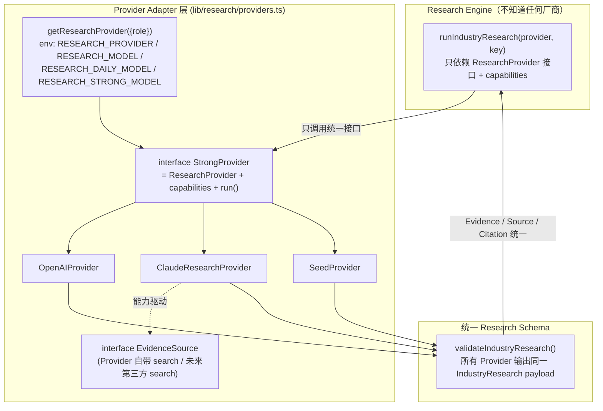

# Deep Research · Provider + Capability 架构（P17 Track 2）

> 目标：Deep Research **不绑定任何具体模型/厂商**。Research Engine 只认统一接口与能力位；
> 模型只由环境变量决定，升级模型只改 env、**禁改代码**。

## 1. 架构图



**解耦要点**
- Engine 从不 import Anthropic/OpenAI/Claude；只拿 `ResearchProvider`（`research()`）与 `StrongProvider.capabilities`。
- 模型名只出现在 **env**（`RESEARCH_STRONG_MODEL` 等）与成本参照表；代码内**不写死**要使用的模型。
- Web Search 不与 Engine 耦合：Provider 自带 search（能力位开）或未来实现 `EvidenceSource` 接第三方；两者都归一为 `EvidenceInput`（title/publisher/sourceType/url=citation）。
- Structured Output 由统一 `IndustryResearch` schema + `validateIndustryResearch()` 控制，禁各 Provider 各写各的 JSON。

## 2. Capability 设计（§7）

`StrongProvider.capabilities: ProviderCapabilities`，Engine 依据能力位**自动决定**是否启用（`GenerateOptions.useThinking/useWebSearch` 只是显式关闭开关，默认跟随能力）：

| 能力 | OpenAIProvider | ClaudeResearchProvider | SeedProvider |
|---|:--:|:--:|:--:|
| supportsThinking | ✗ | ✓（adaptive） | ✗ |
| supportsWebSearch | ✗ | ✓（web_search_20260209，可选非强依赖） | ✗ |
| supportsStructuredOutput | ✓（json_object） | ✓ | ✓（预结构化） |
| supportsVision | ✓ | ✓ | ✗ |
| supportsToolUse | ✓ | ✓ | ✗ |
| supportsLongContext | ✓ | ✓（1M） | ✗ |

- **Thinking** 与 **WebSearch** 均为 Provider Capability，非某厂商专属；OpenAI/其它模型将来具备即置位启用。
- `ProviderRunResult.enabled` 记录本次实际启用的 thinking/webSearch/structuredOutput，供审计与 benchmark 对比。

## 3. 统一契约（Engine 只见这些）

```ts
interface ResearchProvider { name; research(key): Promise<ResearchResult>; }          // Engine 依赖
interface StrongProvider extends ResearchProvider {                                    // Adapter 扩展
  kind; model; capabilities;
  checkAvailability(): Promise<AvailabilityReport>;
  run(key, opts?: GenerateOptions): Promise<ProviderRunResult>;
}
```

统一能力：可用性检查 · 超时 · 重试 · 结构化校验(`validateIndustryResearch`) · 用量 · 成本 · 时长 · 原始响应审计(`raw`) · 优雅降级(`runWithFallback`) · 任务失败隔离。

## 4. 环境变量（服务器 `/opt/tohoshou/.env`，值由用户配置，代码不读日志/不入 Git）

```
RESEARCH_PROVIDER=anthropic          # openai | anthropic | seed
RESEARCH_STRONG_MODEL=<模型ID>        # 深研主力（如 claude-opus-4-8）——只在此配置，禁写码
RESEARCH_DAILY_MODEL=<模型ID>         # 每日增量（可较轻）
RESEARCH_MODEL=<模型ID>               # 默认/OpenAI 路径
ANTHROPIC_API_KEY=<key>              # 仅服务器 .env；禁打印/提交/日志
OPENAI_API_KEY=<key>
```

## 5. 质量 Benchmark（§8，达标前禁 Phase 5 批量）

`scripts/research/benchmark.ts` 三产业同 schema/审核口径对比可用强模型：
**AI 半导体（对人工核验种子真值）· AI HBM · AI 医疗**。指标：Claim/Evidence 覆盖、无证据 Claim 比例、重复率、幻觉代理（vs 种子多出的上市代码）、Token、成本、耗时；人审项（可验证率/关系准确率/可发布率）→ Review Center 终判。

**门槛**：重大 Claim 证据覆盖 ≥95% · 无证据确定 Claim=0 · 股票代码错误=0 · 事实幻觉=0 · Schema=100% · 边重复<2% · 人审可发布≥85%。达标后选质价比最佳者作 `RESEARCH_STRONG_MODEL`，逐产业进入 Phase 5。
