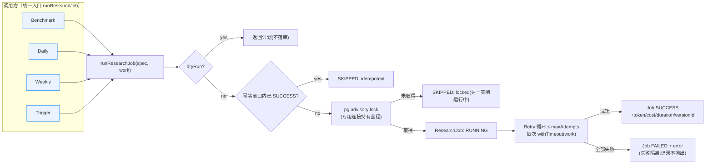
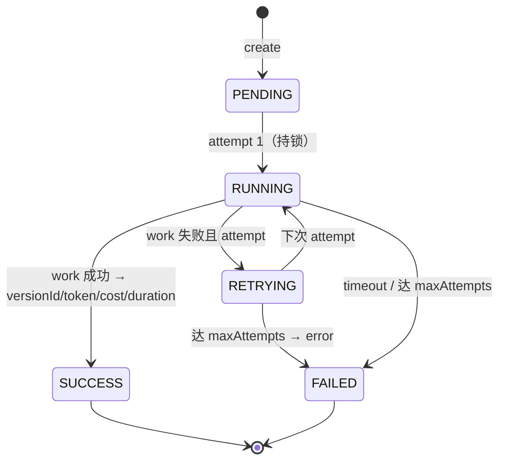

# Deep Research · 统一调度基础设施（P17 Track 1）

> 唯一 Scheduler（`lib/research/scheduler.ts`），统一供 **Benchmark / Daily / Weekly / Trigger**——禁重复实现。
> Job History 复用现有 `ResearchJob`，**不新增数据结构**。

## 1. Scheduler 架构



**能力**：分布式锁(pg advisory，跨进程/主机) · Retry(退避) · Timeout(单次 work) · 幂等(窗口内已成功则跳过) · dry-run(仅计划) · Job History(ResearchJob) · 失败隔离(错误记录在 Job，不抛出；批量用 `runResearchJobsIsolated`)。

## 2. Job 生命周期流程



`ResearchJob` 字段映射：`status`(PENDING/RUNNING/RETRYING/SUCCESS/FAILED) · `attempt`/`maxAttempts` · `provider`/`model` · `tokenUsage`/`estimatedCost`/`durationMs` · `error` · `versionId` · `startedAt`/`finishedAt`。

## 3. 分布式锁（无新表）

Postgres advisory lock：`pg_try_advisory_lock(hashtextextended(key,0))`，key=`research:{jobType}:{industryKey|targetKey|global}`。
专用单 `pg.Client` 连接持有锁**全程**（避免连接池导致 unlock 走到别的连接），结束 `pg_advisory_unlock` 并关闭连接。

## 4. 统一用法（Phase 5 / Daily / Weekly / Trigger / Benchmark 共用）

```ts
import { runResearchJob } from "@/lib/research/scheduler";
import { getResearchProvider } from "@/lib/research/providers";

await runResearchJob(
  { jobType: "INDUSTRY_DEEP", industryKey: "AI_HBM", provider: "anthropic", model: process.env.RESEARCH_STRONG_MODEL, maxAttempts: 3, timeoutMs: 600_000 },
  async () => {
    const prov = getResearchProvider({ role: "strong" });
    const r = await prov.run("AI_HBM");
    // …engine 落库(AI_RESEARCHED，待人审)… 返回用量供 Job History
    return { tokenUsage: { total: r.usage.totalTokens }, estimatedCost: r.usage.estimatedCost, versionId: undefined };
  }
);
```

`dryRun: true` → 只返回计划（含是否会被幂等跳过），不落库、不执行；Dashboard「System Health」读 ResearchJob 各 jobType 最近状态 + Queue 深度 + Scheduler(pg_advisory) 可用性。
